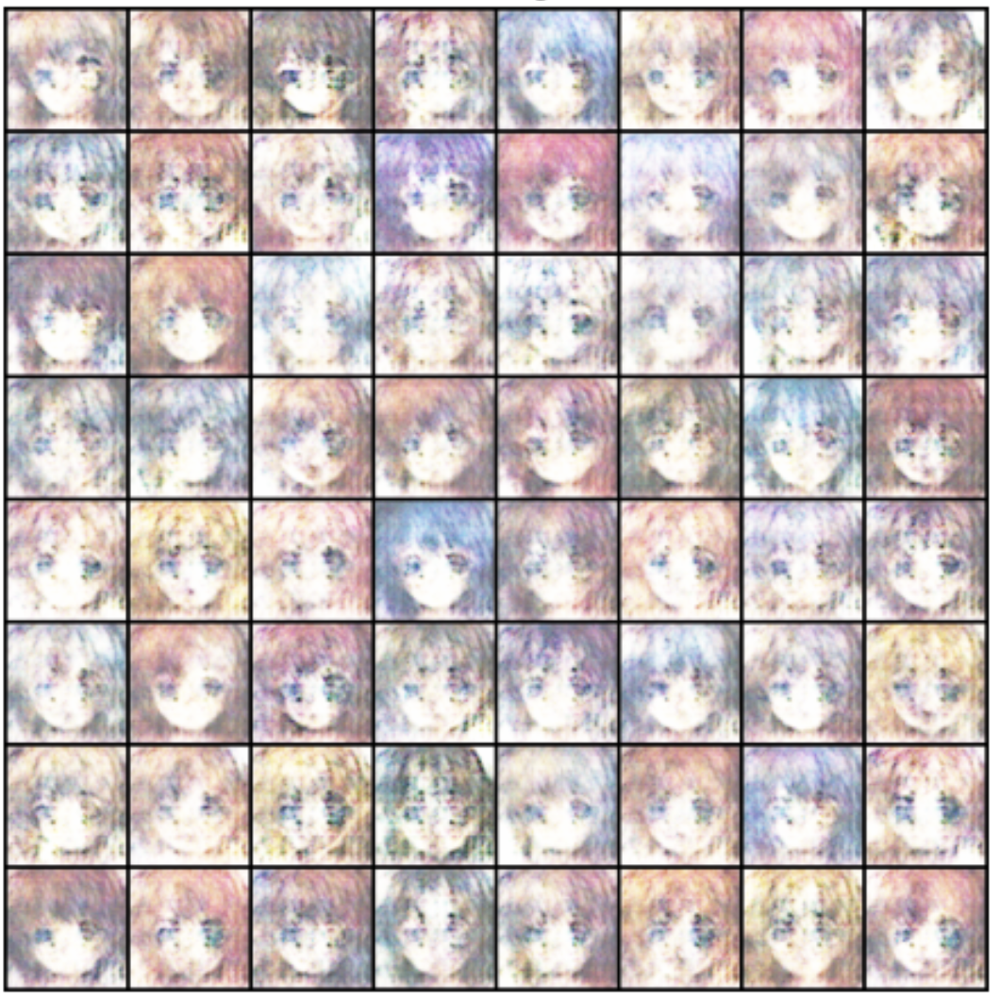
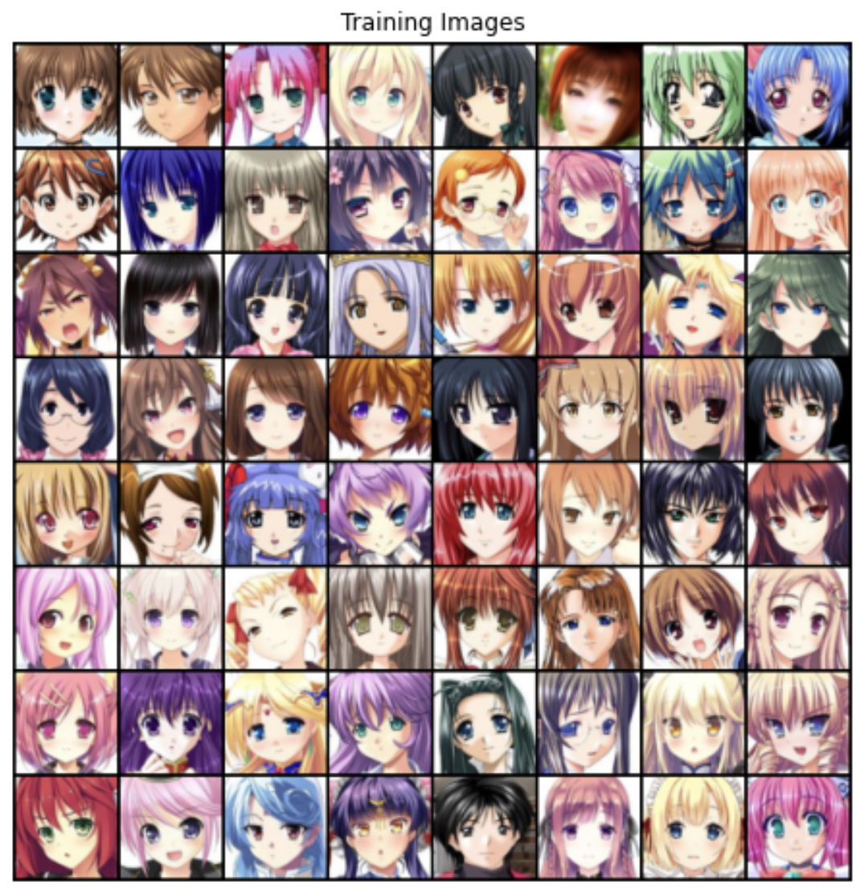

# Generating Anime Characters Using DCGANs

## Introduction

The main aim of this project is the generation of anime characters, but the task is achieved not by any manual procedure; instead, it is executed automatically by a generative model which is trained along with a discriminative model to obtain the appropriate level of accuracy in our output/generated anime image. Since here we are using generative adversarial network architecture, the type of learning implemented here would be unsupervised. Also, the problem here is that we are not simply generating images/anime characters that are already present, but we are aiming to generate some random images that have the features of an anime character, but at the same time, the image should itself be different compared to dataset images. We can understand our requirement with the below figure where we are taking two pictures from the dataset and creating a third image, which is not part of the dataset.

The primary use of this kind of generative model is that it comes in handy in the anime and manga and comic book industry where artists have to create new characters for new anime series. First and foremost of why we decided to work on this topic is because we wanted to work on a topic related to the implementation of the generative adversarial network rather than working on theory, and the second would be because we all love anime and wanted to do some work related to the topic!

## Background

This section will look upon the basic tools and understanding required to understand the paper:
- Neural Network
- Convolutional Neural Network
- Generative Model
- Discriminative Model
- Auto-encoders
- Generative Adversarial Network Neural Network

The idea of the neural network is derived from the working of the human brain. A neuron or node in a neural network is a mathematical function that collects and classifies information according to a specific architecture, and a neural network is the result of such interconnected nodes. The neural network with a single node is called perceptron and feeds the passes result to a nonlinear activation function. In a neural network, perceptrons are arranged in interconnected layers. The input layer collects input patterns. The output layer has classifications to which input patterns may map. Finally, the Hidden layers fine-tune the input weightings or parameters until the neural network’s margin of error is minimal.

### Convolutional Neural Network

Even though neural networks are very strong it has few drawbacks, to overcome these drawbacks we introduce the concept of convolutional neural network. The main drawbacks that we face in case of neural network are a large number of parameters and also the dependence between different features is not captured properly and efficiently in case of neural network, and this problem is quite severe in case of image processing since there are large number of features and the spatial information is lost when they are flattened. Also, nodes that are close together are important because they help to define the features of an image. So in order to capture this dependence between features we pass a filter with the same number of channels as the image over the entire and perform the convolution operation which will generate so and obtain output with a particular dimension which is determined on the basis of the operation performed. This operation is the key function of a convolutional layer that is performed over and over for different convolutional layers decreasing the dimension of the image and also taking into account the relation between different features of the image. The output from the last convolutional layer is flattened and passed to a dense layer containing a different number of nodes based on the task we are performing.

### Generative Model

A generative model describes how a dataset is generated, in terms of a probabilistic Model. It uses unsupervised learning in general to learn the required distribution. The main aim of all generative models is to learn the true distribution of data used in training and further generate new data points from this distribution with some alterations. But it is not always possible to learn the exact distribution of the training data either implicitly or explicitly and so we try to model a distribution(Pdata) which is as close as possible to the true data distribution(Pg).

### Discriminative Model

A discriminative model is synonymous with supervised learning or learning a function that maps an input to an output using a labeled dataset. It learns the difference between classes present in the dataset and how to distinguish between them. The discriminative model predicts the testing data, which is labeled, belongs to which class, and based on how much error is there in the prediction we can alter the parameters that will ultimately stop when we achieve the least possible error margin. Hence, the ultimate goal of a discriminator can be said to be that of separating one class from another.

### Autoencoders

In Autoencoders we take the help of the neural networks for the task of representation learning. Specifically, we aim to use neural network architecture to map a multi-dimensional representation of the input to a latent space with a lower dimension that is easier to represent. This action of mapping an input to a latent space is carried by the encoder section of the autoencoders whereas the action of reconstructing the image(data) from the latent space to its original dimension is the responsibility of the decoder section of the autoencoder. If the input features were each independent of one another, this compression and reconstruction would be a very difficult task. However, if there is some sort of dependence among the features, which is mostly there in most data, this structure can be learned and hence can be used when forcing the input through the network's bottleneck.

### Generative Adversarial Network (GAN)

GAN is one of the deep learning models/techniques used to generate new data from scratch in an unsupervised learning environment. The new data generation is done on the basis of the distribution that the model learns on the basis of training data, which is labeled. GAN composes into two neural networks, the Discriminator and Generator. The generator will generate some fake data and the Discriminator will identify a couple of data that has the fake data generated by the Generator and data sampled from real data. The objective of the Generator is mainly to generate some fake data that is intended similar to the real data and fool the Discriminator into identifying what data is real and fake. The objective of the Discriminator is to make it smarter on identifying the real and fake data. Both generator and discriminator will move alternatively and change their parameters based on the error calculation without affecting the parameters of another. By doing so we hope that they will both be trained in such a way that the generator will be able to generate images, which are as close to the real distribution as possible, and the discriminator will be able to identify whether an image is real or fake with maximum accuracy.

## Related works

### Using Variational Autoencoders:

Variation autoencoders are another category of autoencoders. They are quite different from autoencoders, they are probabilistic autoencoders meaning that their output is partly determined by chance even after training. Most importantly they are generative autoencoders meaning that they can generate new instances that look like they were sampled from training dataset VAEs, instead of directly producing a coding for a given input the encoder produces a mean coding(mu) and standard deviation(sigma). The actual coding is then sampled randomly from Gaussian distribution with mean(mu) and standard deviation(sigma). Variation autoencoders make it possible to perform semantic interpolation: instead of interpolating two images at the pixel level, we can interpolate at the coding level. For several years variational autoencoders were quite popular but GANs eventually took the lead, in particular, because they are capable of generating more realistic and crisp images.

### Using StyleGAN2 :

The StyleGAN [1][2] approach is based on the paper, “A Style-Based Architecture for GANs”, which was published by NVIDIA. This approach allows us to control different levels of details of the generated samples from the evident details (eg. head shape, hair color) to the finer details (eg. eye color). StyleGAN [1][2] also incorporates the idea from Progressive GAN [3], where the networks are trained on lower resolution initially (4x4), then bigger layers are gradually added after it’s stabilized. By doing this, the training time becomes a lot faster and the training is a lot more stable.

## Methodology

### Target applications:
Anime generation can be used in the huge anime industry, saving a lot of time, effort, and human labor. It can be used to generate more realistic images with much less effort. New and on-demand characters can be synthesized with GAN.

### Network structure:
Discriminator and generator are deep convolutional networks, discriminator consists of several blocks and each block consists of a convolution layer followed by a batch normalization layer and then leaky relu activation is applied to the batch normalization output. Similarly, the generator consists of several blocks and each block consists of a transposed convolution layer followed by a batch normalization layer and then leaky relu activation is applied to the batch normalization output.

### Loss function:
We have used Binary Cross Entropy (Log Loss) as a loss function for this problem, since Discriminator is differentiating between real images and fake images so the discriminator can be inferred as a binary classifier between real and fake images, and in case of binary classification binary cross entropy loss function turns out to be one of the best loss functions. Though BCE loss has many downsides but it is a good starting point for the different experiments, In further experiments we can also use Wasserstein Distance as GAN Loss Function.

### Dataset:

For GAN training we have used a mixed dataset from different sources since it will be more diverse and may yield better results, our dataset consists of around 2000 images of anime characters. We used anime face dataset found on Kaggle, some images from google image search, and some images from online anime websites.

### Quality metric:
True images as well as generated images were given as input to the discriminator and the discriminator predicted whether the image is coming from real data or fake. In the case of real input we would get a tensor having values close to one whereas in case of fake data, values in tensor would be close to 0. Then we took the mean of the tensor to report the accuracy of the model. Another metric to evaluate the performance of the model is binary cross entropy which was used to measure real loss of discriminator (calculated between prediction of real images and target as 1), fake loss of discriminator (calculated between prediction of fake images and target as 0) and generator loss (calculated between prediction of fake images and target as 1).

### FID SCORE:
The Frechet Inception Distance score, or FID [6] for short, is a metric that calculates the distance between feature vectors calculated for real and generated images. The score reflects how comparable the two groups are in terms of statistics on computer vision aspects of raw images calculated with the inception v3 image classification model. Lower scores imply that the two groups of photos are more comparable or have similar statistics, whereas a perfect score of 0.0 indicates that they are identical.

## Experimental Implementation

Implementing the DC-GAN [5] is a crucial part of the project. We have implemented the DC-GAN [5] model on google colab, which provides us with an online GPU with limited time and memory to train the model. Due to limited resources, we cannot train the model for a large number of epochs. We have used the PyTorch library implemented in Python to design the architecture of the GAN. PyTorch is an open-source machine learning library based on the Torch library, used for applications such as computer vision and natural language processing, primarily developed by Facebook's AI Research lab. Generator is composed of 5 blocks of which the first 4 blocks each consists of a 2D Transposed Convolution Layer followed by Batch Normalization which is further followed by ReLU activation layer while the last block only consists of 2D Transposed Convolution Layer followed by a tanh activation layer. Generator takes the input of a latent vector in z space which is of size 100 x 1 and spits out the fake image of Anime. Similarly, Discriminator also consists of 5 blocks of which the first 4 blocks each consists of a 2D Convolution Layer followed by Batch Normalization which is further followed by LeakyReLU activation layer whereas the last block consist of a 2D Convolutional layer followed by a sigmoid activation function layer. We used Binary Cross Entropy as our loss function for both Discriminator and Generator, with the batch size of 128 and each image is rescaled to 64x64 RGB channel image. We train the model using Adam optimization algorithm having beta1 as 0.5. We have used different learning rates for Generator and Discriminator, which are 0.0001 for generator and 0.0004 for discriminator. The model is trained for 70 epochs.

## Ablation Studies

- Average time taken for training without FID [6] calculation per epoch (seconds): 9.21
- Average time taken for training with FID [6] calculation per epoch (seconds): 27.71
  This shows FID [6] score calculation is 3 times slower than the implementation without FID [6] calculation.

- FID [6] score without removing additional images from dataset: 282.2
- FID [6] score after removing additional images from dataset: 302.60
  Loss calculated without removing additional images from dataset:
  - Generator Loss: 1.99
  - Discriminator Loss: 0.82
  Loss calculated after removing additional images from dataset:
  - Generator Loss: 2.66
  - Discriminator Loss: 0.69

- FID [6] score with z space of size 100: 282.2
- FID [6] score with z space of size 50: 325.9335
  As we decrease the size of latent space from 100 to 50, the FID [6] score seems to increase significantly, that is GAN is not able to encode much information in less size of latent space.
  As we decrease the batch size from 128 to 64, the FID [6] score is not hugely impacted.

## Limitations

1. Hard to achieve Nash equilibrium: It is hard to find Nash Equilibrium, when two models are trained simultaneously in two-player non-cooperative games. In GAN training both discriminator and generator mode are fighting with each other and solving complex minimax problems. Updating model gradients concurrently cannot guarantee convergence even when the model updates its cost independently.
2. Vanishing gradient: When the discriminator is perfect, we are guaranteed with 𝐷(𝑥) = 1; ∀ 𝑥 ∈ 𝑝 𝑟 and 𝐷(𝑥) = 0; ∀ 𝑥 ∈𝑝 𝑔. Therefore the loss function L falls to zero and we end up with no gradient to update the loss during learning iterations. If the discriminator doesn't perform well then the generator does not have accurate feedback and the loss function becomes untrustworthy. Also If the discriminator does a great job, the gradient of the loss function eventually becomes very less and the learning becomes super slow or even jammed.
3. Mode collapse: This is a common failure case for GANs, Mode collapse is the phenomenon of generator being able to produce only a particular type of images because this type of images are easily fooling the discriminator, Thus our model may fail to represent the real-world complex data and the distribution and get stuck in a small space with extremely low variety.

## Failure Examples

- Our GAN was not able to synthesize male anime characters. It was only generating female anime characters. Although, we manually tried to inject some diversity in the dataset but it didn’t work. We think using StyleGAN [1][2] should help in solving this problem.
- Our Model was not able to generate body features of the characters even after introducing multiple such images into our Dataset.
- The image generated by GAN contains a checkerboard pattern. The generator in the GAN architecture is required to upsample input data in order to generate an output image. Transposed convolution, also known as deconvolution, is a popularly used layer to upsample low-resolution images to a higher resolution using learnable kernels. Thus this layer, both upsamples the input and learns how to fill in details during the model training process. It allows the model to use every point in the small image to “paint” a square in the larger one. Unfortunately, deconvolution can easily have “uneven overlaps” which appear as checkerboard artifacts. A straightforward solution is to use deconvolution without uneven overlap by ensuring that the kernel size is divisible by the stride.

## Results

The above graph shows losses of generator and discriminator over the several number of iterations. At the start of training, our generator is like a newborn child, who doesn't have knowledge of real data samples, so it generates random noise images, so generator loss is very high in the beginning. It is easy for a discriminator at the beginning to classify between real and generated images. As the time grows, we can see that the generator starts gaining knowledge of the real world by the loss and starts improving its loss. It is getting hard for discriminator to classify between real and fake images and it is hard for it to decrease its loss, so it stays where it was in the beginning. Figure x displays the image generated by our Model after the 70th epoch. We can see that the images started to show some real looking images of Anime characters, although these images are of low Fidelity, but if we use more sophisticated model architecture for training, then the Fidelity and diversity of the generated image can be hugely improved.

## Conclusion

In conclusion, we can say that our model is able to generate realistic images of Anime characters by using simple DC-GAN [5] architecture. Although these images are of low quality but with some improvements, we can generate high-quality images that can be used as real anime generation. Improvements like increasing the number of images in our Dataset, Increasing the Size of Model(number of layers), tuning the hyperparameters etc.

## References:

[1] https://openaccess.thecvf.com/content_CVPR_2019/html/Karras_A_Style-Based_Generator_Architecture_for_Generative_Adversarial_Networks_CVPR_2019_paper.html

[2] https://arxiv.org/abs/1812.04948 “A Style-Based Generator Architecture for Generative Adversarial Networks Tero Karras, Samuli Laine, Timo Aila”

[3] https://arxiv.org/abs/1710.10196 “Progressive Growing of GANs for Improved Quality, Stability, and Variation Tero Karras, Timo Aila, Samuli Laine, Jaakko Lehtinen” Wasserstein GAN (Arjovsky, Chintala, and Bottou, 2017): https://arxiv.org/abs/1701.07875

[4] Improved Training of Wasserstein GANs (Gulrajani et al., 2017): https://arxiv.org/abs/1704.00028

[5] Unsupervised Representation Learning with Deep Convolutional Generative Adversarial Networks (Radford, Metz, and Chintala, 2016): https://arxiv.org/abs/1511.06434

[6] Large Scale GAN Training for High FID [6]elity Natural Image Synthesis (Brock, Donahue, and Simonyan, 2019): https://arxiv.org/abs/1809.11096

[7] The Fréchet Distance between Multivariate Normal Distributions (Dowson and Landau, 1982): https://core.ac.uk/reader/82269844
